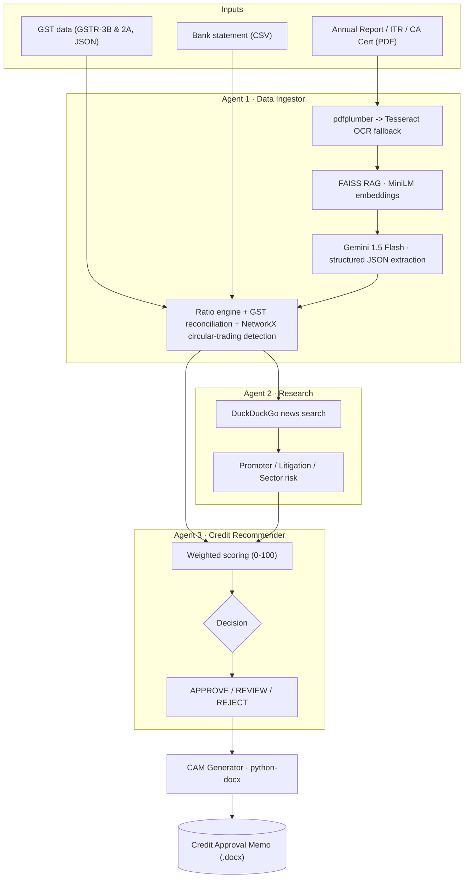

# Intelli-Credit

**An AI multi-agent pipeline that turns raw Indian financial documents into a bank-style Credit Approval Memo (CAM).**

Feed it an annual report (or ITR / CA certificate), optional GST and bank-statement data, and Intelli-Credit extracts the financials, scans for fraud signals and adverse news, scores creditworthiness out of 100, and generates a formatted `.docx` credit memo — the kind an analyst would otherwise assemble by hand.

> ⚠️ **Prototype.** Built as a hackathon project and iterated since. It demonstrates an end-to-end agentic architecture, not a production underwriting system. See [Limitations](#limitations).

---

## What it does

Credit officers at Indian banks/NBFCs manually read 100+ page annual reports, cross-check GST filings, search for promoter red flags, and compute ratios before every loan decision. Intelli-Credit automates that first pass with three cooperating agents.



---

## The agents

| Agent | File | Responsibility |
|-------|------|----------------|
| **1 · Data Ingestor** | [`agents/ingestor.py`](agents/ingestor.py) | Extracts text (pdfplumber, OCR fallback), builds a **FAISS** vector index with `all-MiniLM-L6-v2`, retrieves relevant chunks per document type, and asks **Gemini 1.5 Flash** for structured JSON. Auto-detects document type and monetary unit (lakhs/crores/millions). Runs **GSTR-3B vs GSTR-2A reconciliation** and **NetworkX graph-based circular-trading detection** on the bank data. |
| **2 · Research** | [`agents/researcher.py`](agents/researcher.py) | Searches the web (DuckDuckGo) for promoter/company adverse news, and applies rule-based **sector risk** (NBFC, Banking, Manufacturing, IT, Real Estate, …) with recent RBI-action context. |
| **3 · Credit Recommender** | [`agents/recommender.py`](agents/recommender.py) | Combines all signals into a weighted score out of 100 (financial health, fraud signals, research), applies hard-reject rules for high-severity flags, and outputs an **APPROVE / REVIEW / REJECT** decision with a full point-by-point breakdown. |
| **CAM Generator** | [`generators/cam_generator.py`](generators/cam_generator.py) | Renders the final decision into a styled Word **Credit Approval Memo** (`outputs/cam.docx`). |

Orchestrated by [`main.py`](main.py); a **Streamlit** front-end lives in [`ui/app.py`](ui/app.py).

---

## Tech stack

- **Python 3.11**
- **LLM:** Google Gemini 1.5 Flash (via REST API)
- **RAG:** FAISS + `sentence-transformers` (`all-MiniLM-L6-v2`, CPU)
- **Extraction:** pdfplumber, Tesseract OCR (`pytesseract` + `pypdfium2`)
- **Analysis:** pandas, NetworkX (circular-trading graph cycles)
- **Research:** DuckDuckGo search (`ddgs`)
- **Output:** python-docx
- **UI:** Streamlit

---

## Quick start

### 1. Clone & create a virtual environment
```bash
git clone https://github.com/Nooronclouds/intelli_credit.git
cd intelli_credit
py -3.11 -m venv venv
venv\Scripts\activate        # Windows
# source venv/bin/activate   # macOS/Linux
```

### 2. Install dependencies
```bash
pip install -r requirements.txt
```

### 3. Install Tesseract OCR (only needed for scanned PDFs)
Download from the [UB-Mannheim build](https://github.com/UB-Mannheim/tesseract/wiki) and install to
`C:\Program Files\Tesseract-OCR\`. On macOS/Linux use `brew install tesseract` /
`apt install tesseract-ocr` and update the path in [`agents/ingestor.py`](agents/ingestor.py).

### 4. Add your Gemini API key
Get a free key at [Google AI Studio](https://aistudio.google.com/apikey), then:
```bash
cp .env.example .env
```
and put your key in `.env`:
```
GEMINI_API_KEY=your_key_here
```

### 5. Run it
```bash
# CLI pipeline (uses the bundled sample annual report)
python main.py

# or the Streamlit UI
streamlit run ui/app.py
```

The CLI prints the score and decision and writes the memo to `outputs/cam.docx`.

---

## Usage

Call the pipeline directly with your own documents:

```python
from main import run_pipeline

run_pipeline(
    pdf_path="data/sample_annual_report.pdf",
    gst_json_path="data/sample_gst.json",             # optional
    bank_csv_path="data/sample_bank_statement.csv",   # optional
    company_name="Muthoot Finance Ltd",               # optional — auto-extracted if omitted
    doc_type=None,                                     # None = auto-detect
)
```

`doc_type` accepts `"annual_report"`, `"itr"`, or `"ca_certificate"` (or `None` to auto-detect).

---

## Sample output

```
============================================================
   PIPELINE COMPLETE
============================================================
   Company  : Muthoot Finance Ltd
   Score    : 74/100
   Decision : APPROVE
   CAM      : outputs/cam.docx
============================================================
```

Every decision ships with a transparent breakdown — e.g. *"DSCR: +15 (strong, 2.3x)"*,
*"GST Reconciliation (CLEAN): 0"*, *"Sector Risk (NBFC — CAUTIOUS): -8 (RBI tightened gold-loan
norms)"* — so the reasoning behind the score is always auditable.

---

## Project structure

```
intelli_credit/
├── main.py                     # Pipeline orchestrator
├── agents/
│   ├── ingestor.py             # Agent 1 — extraction + fraud signals
│   ├── researcher.py           # Agent 2 — web research + risk
│   └── recommender.py          # Agent 3 — scoring + decision
├── generators/
│   └── cam_generator.py        # Credit Approval Memo (.docx)
├── ui/
│   └── app.py                  # Streamlit front-end
├── data/                       # Sample documents
├── outputs/                    # Generated JSON + CAM (git-ignored)
├── requirements.txt
└── .env.example
```

---

## Limitations

This is a prototype, and it's honest about it:

- **Extraction** relies on Tesseract OCR + vector retrieval; it can miss values in merged cells, footnotes, or heavily-scanned tables.
- **Retrieval** is vector-only (FAISS) — no hybrid keyword/BM25 search or re-ranking yet, so exact-match terms (CIN, EBITDA) aren't specially handled.
- **Litigation risk** in Agent 2 is currently a mock stub; **sector risk** is rule-based rather than live.
- The **Tesseract path is hard-coded for Windows** in `ingestor.py`.
- No automated test suite or confidence-scored human-in-the-loop review yet.

## Roadmap

- Layout-aware parsing for complex financial tables
- Hybrid retrieval (BM25 + dense) with a re-ranking stage
- Per-field confidence scores + human-in-the-loop correction UI
- Live litigation / court-record lookups
- Cross-platform packaging (Docker) and a hosted demo

---

*Built by [@Nooronclouds](https://github.com/Nooronclouds).*
